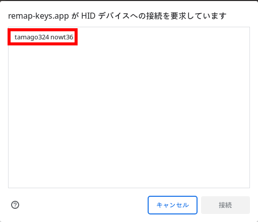
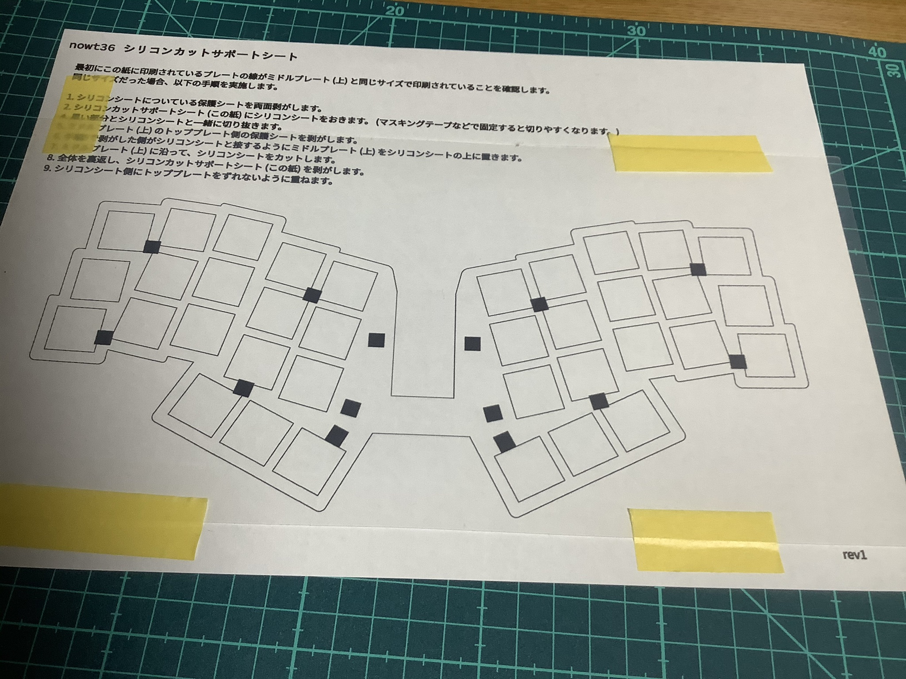
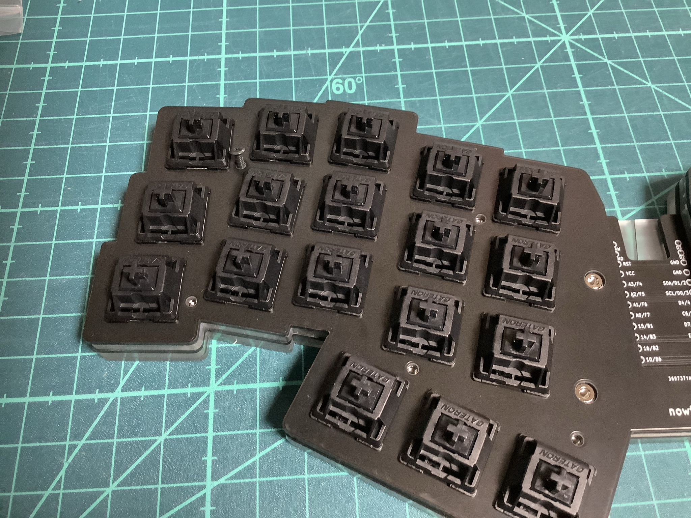

# nowt36 ビルドガイド

nowt36 のビルドガイドです。

目次

<!-- vim-markdown-toc GFM -->

* [キットに含まれるもの](#キットに含まれるもの)
* [キット以外に必要なもの](#キット以外に必要なもの)
* [組み立て順序の確認](#組み立て順序の確認)
* [組み立て](#組み立て)
  * [1. ファームウェアの書き込み](#1-ファームウェアの書き込み)
    * [Remap で書き込む場合](#remap-で書き込む場合)
    * [LED の動作確認のため、LED機能をONにします。](#led-の動作確認のためled機能をonにします)
  * [2. (オプション) プレートの側面をペンで塗る](#2-オプション-プレートの側面をペンで塗る)
  * [3. (オプション) LEDの取り付け](#3-オプション-ledの取り付け)
  * [4. ダイオードのはんだ付け](#4-ダイオードのはんだ付け)
  * [5. ホットスワップソケットのはんだ付け](#5-ホットスワップソケットのはんだ付け)
  * [6. リセットスイッチのはんだ付け](#6-リセットスイッチのはんだ付け)
  * [7. (オプション) ミドルプレート (上) とトッププレートの間にシリコンシートを挟む](#7-オプション-ミドルプレート-上-とトッププレートの間にシリコンシートを挟む)
  * [8. トッププレートの端にスイッチを取り付ける](#8-トッププレートの端にスイッチを取り付ける)
  * [9. PCBにトッププレートとスイッチを取り付ける](#9-pcbにトッププレートとスイッチを取り付ける)
  * [10. ボトムプレートを取り付ける](#10-ボトムプレートを取り付ける)
  * [11. トッププレート側からネジ止めする](#11-トッププレート側からネジ止めする)
  * [12. ProMicro保護プレートを取り付ける](#12-promicro保護プレートを取り付ける)
  * [13. ゴム足を取り付ける](#13-ゴム足を取り付ける)
  * [14. キーキャップを取り付ける](#14-キーキャップを取り付ける)
  * [15. キーマップを変更する](#15-キーマップを変更する)
* [最後に](#最後に)

<!-- vim-markdown-toc -->

## キットに含まれるもの

| No. | 名前                           | 数量        | 備考                                                                                                                                                                          |
|-----|--------------------------------|-------------|-------------------------------------------------------------------------------------------------------------------------------------------------------------------------------|
| 1   | PCB                            | 1枚         | メインPCB                                                                                                                                                                     |
| 2   | トッププレート                 | 1枚         | スイッチをはめるFR4プレート                                                                                                                                                   |
| 3   | ボトムプレート                 | 1枚         | ボトムアクリルプレート                                                                                                                                                        |
| 8   | ProMicro 保護プレート          | 1枚         | ProMicro 保護プレート。                                                                                                                                        |
| 9   | スイッチソケット               | 36個        | [Kailh Switch Socket](https://shop.yushakobo.jp/products/a01ps?pr_prod_strat=copurchase&pr_rec_id=1b68feea8&pr_rec_pid=6055660945569&pr_ref_pid=6055716520097&pr_seq=uniform) |
| 10  | ダイオード                     | 36個 + 予備 | [1N4148W](https://shop.yushakobo.jp/collections/all-keyboard-parts/products/a0800di-02-100)                                                                                   |
| 11  | リセットスイッチ               | 1個         | [タクトスイッチ](https://shop.yushakobo.jp/collections/all-keyboard-parts/products/a0800ts-01-1?variant=37665574977697)                                                       |
| 12  | M2 スペーサー 8mm (短いもの)   | 10個        | トッププレートとボトムプレートを固定するためのスペーサー                                                                                                                      |
| 13  | M2 スペーサー 9.5mm (長いもの) | 4個         | ProMicro保護プレートとボトムプレートを固定するためのスペーサー                                                                                                                |
| 14  | M2 ねじ 5mm                    | 28個 + 予備 | スペーサーを固定するネジ                                                                                                                                                      |
| 15  | アンダーグロー用LED            | 10個        | [WS2812B](https://shop.yushakobo.jp/products/a0800ws-01-10?variant=37664848969889)                                                                                            |
| 16  | ゴム足                         | 10個        | すべり止め用のゴム足                                                                                                                                                          |

## キット以外に必要なもの

| 名前                     | 数量 | 備考 |
|--------------------------|------|------|
| キースイッチ             | 36個 | -    |
| キーキャップ             | 36個 | -    |
| USBケーブル              | 1個  | -    |
| ProMicro                 | 1個  | -    |
| コンスルー or ピンヘッダ | 2枚  | 高さが2.5mm以下のものを使用する必要があります。    |

オプションでミドルプレートをつけられます。

| 名前                     | 数量 | 備考 |
|--------------------------|------|------|
| ミドルプレート (上)            | 1枚         | ※1                                                                     |
| ミドルプレート (下)            | 1枚         | ※1                                                                     |
| シリコンシート 0.5mm           | 1枚         | トッププレートとミドルプレート (上) の間に挟むシリコンシート。[モノタロウなどで購入](https://www.monotaro.com/g/00279214/?monotaroNo=36295253)                                |
| シリコンカットサポートシート   | 1枚         | シリコンシートを切り抜くときに使用する紙。([こちら](/data/rev1/silicon_cut_sheet/silicon_cut_sheet.svg)を印刷します。)                                     |

※1 [こちら](/docs/rev1/data/Laser_A4_inkscape_nowt36_middle_plate.zip?raw=true)のデータを遊舎工房で発注可能です。もとのデータは [こちら](/data/rev1/plate_data/middle_plate) にあるため、自由に加工しAnymanyさんのような他の業者に発注することも可能です。

## 組み立て順序の確認

0. キットの内容物の確認
1. ファームウェアの書き込み
2. (オプション) プレートの側面をペンで塗る
3. (オプション) LEDの取り付け
4. ダイオードのはんだ付け
5. ホットスワップソケットのはんだ付け
6. リセットスイッチのはんだ付け
7. (オプション) ミドルプレート (上) とトッププレートの間にシリコンシートを挟む
8. トッププレートの端にスイッチを取り付ける
9. PCBにトッププレートとスイッチを取り付ける
10. ボトムプレートを取り付ける
11. トッププレート側からネジ止めする
12. ProMicro保護プレートを取り付ける
13. ゴム足を取り付ける
14. キーキャップを取り付ける
15. キーマップを変更する

## 組み立て

### 1. ファームウェアの書き込み

REMAP か [QMK](https://github.com/tamago324/qmk_firmware/tree/nowt36/keyboards/tamago324/nowt36) を使用して、ファームウェアを書き込みます。
LEDをはんだ付けする前に Remap でファームウェアを書き込んでおくことで、LED の取付時に1つ1つ確認することができます。

Remap で書き込む場合

#### Remap で書き込む場合

LED を取り付ける場合、Remap でファームウェアを書き込み、LED機能をONにしておくとLEDが正しくはんだ付けできているかの確認が簡単になるのでおすすめです。

> サリチル酸さんの[記事](https://salicylic-acid3.hatenablog.com/entry/remap-manual#:~:text=%E3%81%A6%E3%81%8F%E3%81%A0%E3%81%95%E3%81%84%EF%BC%81-,%E3%83%95%E3%82%A1%E3%83%BC%E3%83%A0%E3%82%A6%E3%82%A7%E3%82%A2%E3%82%92%E6%9B%B8%E3%81%8D%E8%BE%BC%E3%82%80,-%E3%82%AD%E3%83%BC%E3%83%9C%E3%83%BC%E3%83%89%E3%82%AB%E3%82%BF%E3%83%AD%E3%82%B0%E6%A9%9F%E8%83%BD)を参考に手順を記述しています。

https://remap-keys.app/ にアクセスします。 

KEYBOARD CATALOG をクリックします。

Keyboard name の入力欄に `nowt36` と入力し、Search をクリックし、検索結果の nowt36 をクリックします。

FIRMWARE をクリックします。

FLASH をクリック

ダイアログが表示されたら FLASH をクリックします。

remap-keys.app がシリアルポートへの接続を要求しています という表示が出たら、ピンセットでProMicro の`GND`と`RST`を2回素早く押します。

ProMicro が表示されたら、それを選択し、接続ボタンをクリックします。  

少し時間が立つとファームウェアの書き込みが完了します。

#### LED の動作確認のため、LED機能をONにします。

https://remap-keys.app/ にアクセスします。

`START REMAP FOR YOUR KEYBOARD` をクリックします。

`+ KEYBAORD` をクリックします。

`tamago324 nowt36` をクリックします。

`Lightning` をクリック、

`EffectMode` を `Solid color` を選択します。

以上で、LED の確認のためのファームウェアの書き込みは完了です。

### 2. (オプション) プレートの側面をペンで塗る

PCB と ボトムプレートの側面をペンで塗るときれいに仕上げられます。

### 3. (オプション) LEDの取り付け

PCBの裏の D37 から時計回りにLEDを9個 (D37〜D45) をはんだ付けします。 
PCBの裏のはんだ付けが終わったら PCB の表面の D46 にLEDを1個はんだ付けします。
「PCBのシルクの角」と「LEDのかけている部分」が同じ位置になるようにはんだ付けします。
はんだごての温度は低め (270℃〜300℃) に設定し、作業します。

1つLEDをはんだ付けするたびにUSBを接続し、LED が光ることを確認することをおすすめします。

PCBのシルクの角 に予備ハンダをします。

PCBのシルクの角 と LEDのかけている部分が同じ位置になるようにはんだ付けします。

それ以外の部分をはんだ付けします。

4箇所はんだ付けし終わったらUSBを接続し、LEDが光ることを確認します。
(※ REMAP で LED をONにしておくことで簡単に光ることが確認できます。)

また、LED をはんだ付けするときはUSBケーブルを外してください。

10個の LED をはんだ付けします。

### 4. ダイオードのはんだ付け

PCBの裏にダイオードを36個はんだ付けします。
「PCBのシルクの線」と「ダイオードの線」が一致するようにはんだ付けします。
はんだごての温度は320℃くらいに設定し作業します。

片側に予備ハンダを行い、
ピンセットを使用して、はんだ付けを行い、
もう片方もはんだ付けします。

すべてのダイオードのはんだ付けが終わったら、すべてのダイオードが同じ向きになっていることを確認してください。

### 5. ホットスワップソケットのはんだ付け

PCBの裏にスイッチソケットを36個はんだ付けします。
PCBのシルクが隠れるようにはんだ付けします。
はんだごての温度は320℃くらいに設定し作業します。

片側に予備ハンダを行い、
スイッチソケットを置いて、はんだ付けします。
もう片方もはんだ付けします。

### 6. リセットスイッチのはんだ付け

PCBの裏から RESET という文字が隠れるようにリセットスイッチを差し込みます。
PCBの表に出ている足をはんだ付けします。

### 7. (オプション) ミドルプレート (上) とトッププレートの間にシリコンシートを挟む

オプションでミドルプレートをつけることができます。

手順

[シリコンカットサポートシート](/data/rev1/silicon_cut_sheet/silicon_cut_sheet.svg) をA4用紙で印刷します。

以下の手順でミドルプレート (上) とトッププレートの間にシリコンシートを挟みます。  
最初にシリコンカットサポートシート がミドルプレート (上) と同じサイズで印刷されていることを確認します。  
同じサイズだった場合、以下の手順を実施します。

1. シリコンシートについている保護シートを両面剥がします。

2. シリコンカットサポートシートにシリコンシートをおきます。 (マスキングテープなどで固定すると切りやすくなります。)

3. 黒い部分をシリコンシートと一緒に切り抜きます。

4. ミドルプレート (上) のトッププレート側の保護シートを剥がします。

5. 手順5で剥がした側がシリコンシートと接するようにミドルプレート (上) をシリコンシートの上に置きます。

6. ミドルプレート (上) に沿って、シリコンシートをカットします。

7. ミドルプレート (上) のもう片方の保護シートを剥がします。 (両方の保護シートが剥がれている状態です。)

8. 全体を裏返し、シリコンカットサポートシートを剥がします。

9. シリコンシート側にトッププレートをずれないように重ねます。

### 8. トッププレートの端にスイッチを取り付ける

位置合わせのため、トッププレートの端の数カ所ににスイッチを取り付け、PCB のソケットにスイッチが刺さるように合わせます。

### 9. PCBにトッププレートとスイッチを取り付ける

トッププレートをPCBに取り付けます。

スイッチの足が曲がっていないことを確認し、すべてのスイッチを取り付けます。

### 10. ボトムプレートを取り付ける

まず、ボトムプレートにスペーサーを取り付けます。
ProMicro周辺の4つのスペーサーは9.5mmのスペーサーを取り付けます。
それ以外の部分は、8mmのスペーサーを取り付けます。

TODO: 画像を貼る

オプションでボトムプレートの上にミドルプレート (下) を重ねます。

TODO: 

その上にトッププレート+PCB を重ねます。

### 11. トッププレート側からネジ止めする

ProMicro以外の場所をトッププレート側からネジ止めします。

### 12. ProMicro保護プレートを取り付ける

まず、ProMicro のピンをカットします。

PCB に取り付けます。

ProMicro 保護プレートを載せ、ネジ止めします。

### 13. ゴム足を取り付ける

ボトムプレートの裏にゴム足をつけます。

### 14. キーキャップを取り付ける

キーキャップを取り付けます。

### 15. キーマップを変更する

Remap か QMK を使用してキーマップを変更可能です。

* Remap の場合: キーボードカタログの nowt36 のページで設定可能です。
* QMK の場合: [tamago324/qmk_firmware](https://github.com/tamago324/qmk_firmware/tree/nowt36) の `nowt36` ブランチの `keyboards/tamago324/nowt36` にファームウェアがあります。

## 最後に

完成したキーボードの写真を SNS に投稿していただけるととても嬉しいです！
(ハッシュタグは `#nowt36` です。)

